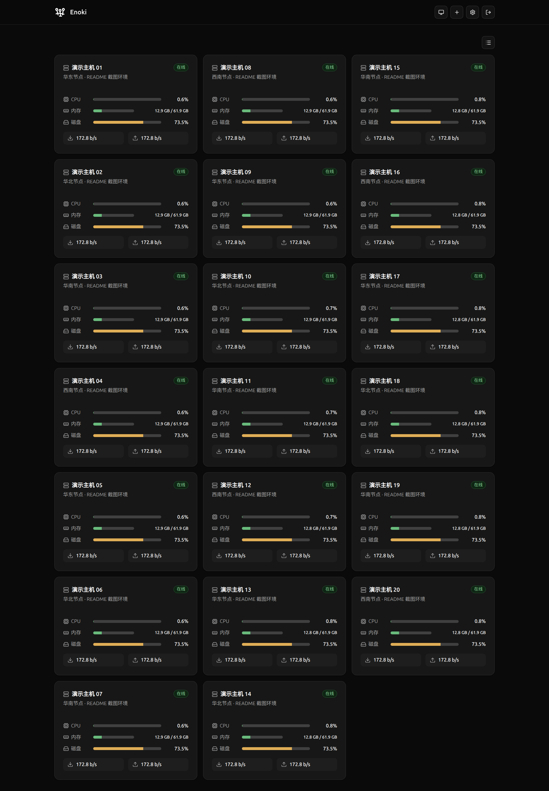
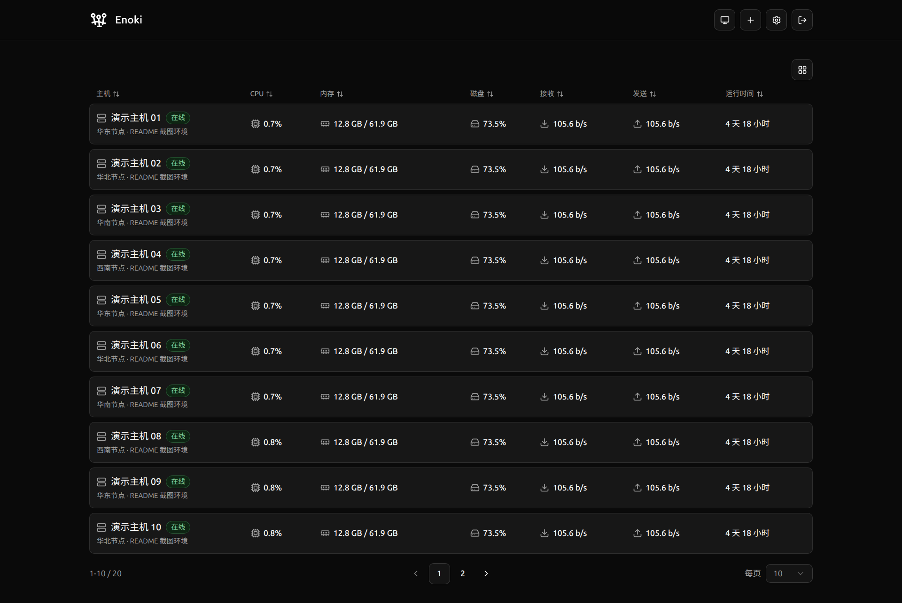
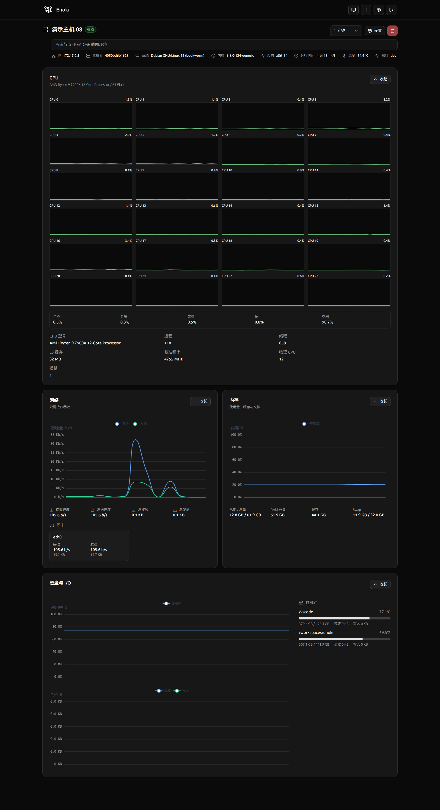

# Enoki

开箱即用的轻量 Linux 服务器监控平台，Rust 编写的探针本体仅 2.2 MiB，单探针常态 PSS 约 2 MiB。

采取探针 POST Hub 架构，使用 [protobuf](https://github.com/protocolbuffers/protobuf) 作数据序列化协议以减少探针消耗的流量。

## 功能

Enoki **没有**以下功能：

- 通过外部命令采集指标
- 多用户系统
- OAuth 验证
- Windows / Mac 等系统支持
- 国际化
- Hub 主动 Pull 探针
- GPU 监控
- S.M.A.R.T. 监控
- 阈值和通知
- Hub 下发任意 Shell 命令
- 通过 Docker 安装探针

Enoki **有**以下功能：

- 针对多种架构编译的探针
- 从 Hub 分发探针二进制文件从而不依赖探针侧额外网络连通性
- REST API
- 主页的卡片瀑布流 / 表格视图
- Hub 侧触发探针更新 / 自删除
- 探针常态下不拥有 root 权限
- CPU / RAM / 磁盘 / 网络接口等多种常见指标
- 可配置的采集和上报间隔
- 探针操作使用一次性操作 token 校验

## 界面

### 卡片主机视图



### 表格主机视图



### 主机详情页



## 安全性

Enoki 的安全边界尽量保持简单：

- Web UI 可查看主机信息并触发敏感操作，建议仅在可信网络中使用
- Probe API 可单独暴露给探针访问，公网部署时应使用 HTTPS 或可信隧道
- 探针身份密钥和 bootstrap 配置需要保持私密，配置文件不应允许其他用户读取
- `ENOKI_WEB_UI_NO_PASSWORD=true` 会让 Web UI 和管理 API 无需登录即可访问，只适合完全可信的内网、演示或临时截图环境，禁止公网裸奔

## 部署

部署分为 Hub 和探针两部分。Hub 推荐使用 Docker 部署；探针在 Web UI 中生成安装命令后，复制到目标 Linux 主机执行。

生产环境和 Docker 部署默认必须设置 `OWNER_PASSWORD`。开发环境如果未设置密码，Hub 会在启动日志中生成一个临时管理员密码；容器部署不会自动生成临时密码，除非显式启用无密码模式。

Hub 容器内默认监听两个端口：

- `3000`：Web UI 和管理 API
- `3001`：Probe API，供探针注册、上报、下载安装脚本和资产

### Docker Run

```sh
docker run -d \
  --name enoki-hub \
  --restart unless-stopped \
  -p 3000:3000 \
  -v /opt/enoki:/data \
  -e OWNER_PASSWORD='请替换为强密码' \
  -e ENOKI_PUBLIC_HUB_URL='https://example.com' \
  -e ENOKI_PUBLIC_HTTPS=true \
  ghcr.io/ykdz/enoki-hub:latest
```

如果需要只把 Probe API 暴露给公网或隧道，可以额外映射 `3001`：

```sh
docker run -d \
  --name enoki-hub \
  --restart unless-stopped \
  -p 3000:3000 \
  -p 3001:3001 \
  -v /opt/enoki:/data \
  -e OWNER_PASSWORD='请替换为强密码' \
  -e ENOKI_PUBLIC_HUB_URL='https://probe.example.com' \
  -e ENOKI_PUBLIC_HTTPS=true \
  ghcr.io/ykdz/enoki-hub:latest
```

### Docker Compose

```yaml
services:
  enoki-hub:
    image: ghcr.io/ykdz/enoki-hub:latest
    container_name: enoki-hub
    restart: unless-stopped
    ports:
      - "3000:3000"
      # 如果 Probe API 需要单独暴露，取消下一行注释。
      # - "3001:3001"
    volumes:
      - /opt/enoki:/data
    environment:
      OWNER_PASSWORD: 请替换为强密码
      ENOKI_PUBLIC_HUB_URL: https://example.com
      ENOKI_PUBLIC_HTTPS: "true"
```

### 环境变量

| 变量                                             | 默认值                                      | 说明                                                                                       |
| ------------------------------------------------ | ------------------------------------------- | ------------------------------------------------------------------------------------------ |
| `OWNER_PASSWORD`                                 | 无                                          | 管理员登录密码。Docker / 生产环境必填。                                                    |
| `ENOKI_WEB_UI_NO_PASSWORD`                       | `false`                                     | 开启后 Web UI 和管理 API 无需登录即可访问。仅适合完全可信的内网、演示或临时截图环境。      |
| `PORT`                                           | `3000`                                      | Web UI 和管理 API 监听端口。容器内通常不需要修改。                                         |
| `HOST`                                           | `0.0.0.0`                                   | Web UI 和管理 API 监听地址。                                                               |
| `ENOKI_PROBE_PORT`                               | `3001`                                      | Probe API 监听端口。容器内通常不需要修改。                                                 |
| `ENOKI_PROBE_HOST`                               | 同 `HOST`                                   | Probe API 监听地址。                                                                       |
| `ENOKI_DATA_ROOT`                                | `/data`                                     | Hub 数据目录。Docker 部署时应挂载持久化目录到这里。                                        |
| `ENOKI_SQLITE_PATH`                              | `/data/enoki.db`                            | SQLite 数据库文件路径。                                                                    |
| `ENOKI_PUBLIC_HUB_URL`                           | 自动使用当前访问地址                        | 生成探针安装命令时使用的 Hub 地址。跨公网、反代或隧道部署时建议显式设置。                  |
| `ENOKI_PUBLIC_HTTPS`                             | `false`                                     | 强制按 HTTPS 生成安全 Cookie。Hub 位于 HTTPS 反代后时建议设为 `true`。                     |
| `ENOKI_TRUST_PROXY_HEADERS`                      | `false`                                     | 登录 Cookie 判断请求是否为 HTTPS 时信任反代头。仅在可信反代后启用。                        |
| `ENOKI_TRUSTED_PROXY_HEADERS`                    | `false`                                     | Probe API 读取探针来源 IP 时信任转发头。仅在可信反代后启用。                               |
| `ENOKI_HOST_STATUS_STALE_AFTER_SECONDS`          | `30`                                        | 主机多久未上报后显示为上报延迟。                                                           |
| `ENOKI_HOST_STATUS_OFFLINE_AFTER_SECONDS`        | `90`                                        | 主机多久未上报后显示为离线，必须大于上一个值。                                             |
| `ENOKI_METRICS_RETENTION_DAYS`                   | `7`                                         | 历史指标保留天数。                                                                         |
| `ENOKI_CLOCK_SKEW_THRESHOLD_SECONDS`             | `300`                                       | 探针时间与 Hub 时间偏移超过此值时记录时钟偏移。                                            |
| `ENOKI_PROBE_INSTALL_PATH`                       | `/usr/local/bin/enoki-probe`                | 生成探针安装命令时使用的默认安装路径。                                                     |
| `ENOKI_PROBE_ASSET_DIR`                          | `/app/probe-assets`                         | Hub 分发探针安装脚本和二进制资产的目录。                                                   |
| `ENOKI_INSTALL_SCRIPT_PATH`                      | `${ENOKI_PROBE_ASSET_DIR}/install-probe.sh` | 探针安装脚本路径。                                                                         |
| `ENOKI_PROBE_OPERATION_ACCEPTED_TIMEOUT_SECONDS` | `300`                                       | 探针操作已接收但未开始运行的超时时间。                                                     |
| `ENOKI_PROBE_OPERATION_RUNNING_TIMEOUT_SECONDS`  | `900`                                       | 探针操作运行中的超时时间。                                                                 |
| `ENOKI_PROBE_OPERATION_TOKEN_SIGNING_SECRET`     | 启动时随机生成                              | 探针升级 / 卸载操作 token 签名密钥。多实例或需要跨重启保留未完成操作时应设置为稳定随机值。 |
