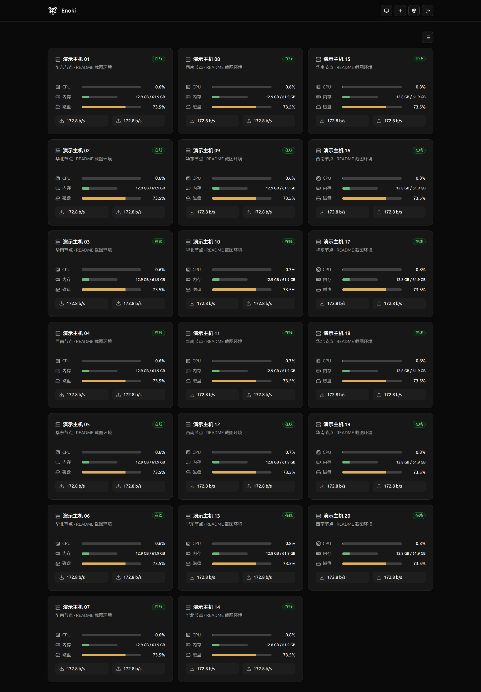
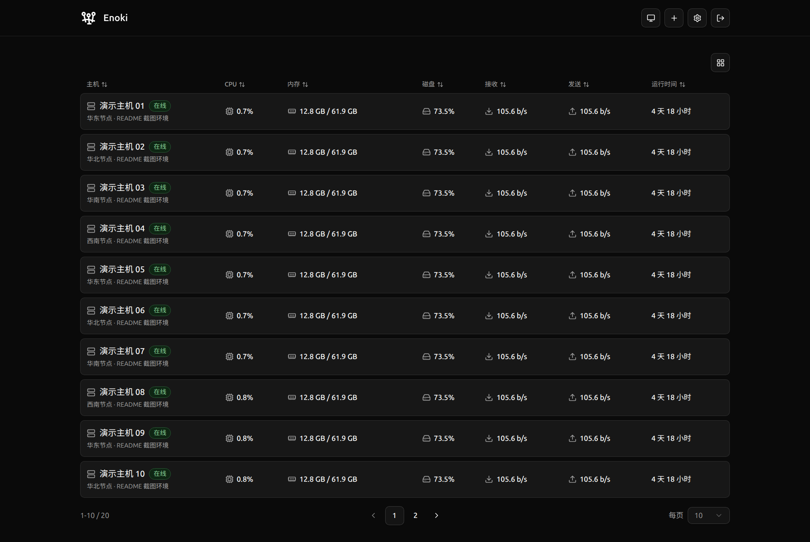
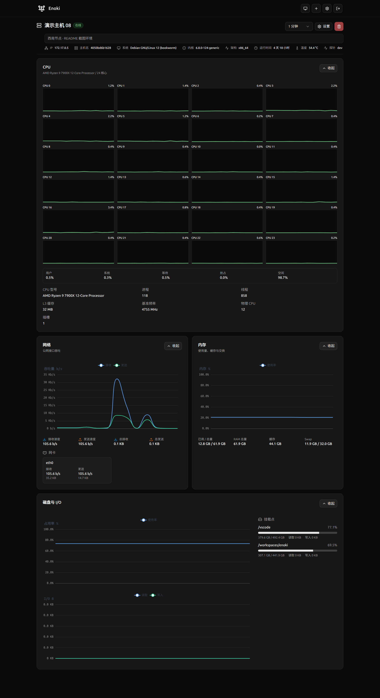

# Enoki


安全且开箱即用的轻量 Linux 服务器监控平台。

Rust 编写的探针本体仅 `3 MiB`，单探针常态 PSS 约 `2 MiB`。

采取探针 POST Hub 架构，使用 [protobuf](https://github.com/protocolbuffers/protobuf) 作数据序列化协议以减少探针消耗的流量。

## 功能

Enoki **没有**以下功能：

- 多用户系统
- OAuth 验证
- Windows / Mac 等系统支持
- 国际化
- Hub 主动 Pull 探针
- GPU 监控
- 阈值和通知
- Hub 下发任意 Shell 命令
- 通过 Docker 安装探针

Enoki **有**以下功能：

- 针对多种架构编译的探针
- 从 Hub 分发探针二进制文件从而不依赖探针侧额外网络连通性
- REST API
- 主页的卡片瀑布流 / 表格视图
- Hub 侧发起探针升级、删除主机或卸载探针并删除主机
- 探针常态下不拥有 root 权限
- CPU / RAM / 磁盘 / 网络接口等多种常见指标
- 基于时钟的指标级采集 / 上报间隔
- 主机级可以开关的指标

> Enoki 有意保持这种简洁性，若你需要更多外部指标，可以自行二次开发。
>
> 我们的架构从探针到数据库到 Web UI 全链路都易于在编译前扩展；现有签名、资产分发和探针本机边界可作为自定义分发链路的基础。

## 界面

### 卡片主机视图



### 表格主机视图



### 主机详情页



## 安全性

Enoki 的安全边界尽量保持简单：

- 管理界面可查看主机元数据并触发探针升级、删除主机或卸载探针并删除主机，建议仅在可信网络中使用
- 除显式启用无密码模式外，所有部署都必须显式设置 `OWNER_PASSWORD`；`ENOKI_WEB_UI_NO_PASSWORD=true` 只适合完全可信的内网、演示或临时截图环境。生产或 Docker 环境必须同时显式设置 `ENOKI_ALLOW_INSECURE_NO_PASSWORD=true` 才能启用无密码模式
- 管理面和探针 API 分别使用显式 Origin；两者可按部署网络选择 HTTP 或 HTTPS。显式的非 loopback HTTP 会在 Hub 启动时记录一次结构化警告：它放弃了传输保密性和服务器身份认证，但不会放宽应用认证
- 探针注册后会生成自己的非对称身份密钥，后续上报和操作状态使用请求签名证明身份。签名会绑定请求方法、目标地址、路径、查询参数、随机数、时间戳和请求体摘要
- Hub 不终止 TLS、不重定向 HTTP 到 HTTPS，也不发送 HSTS；证书、协议跳转和 HSTS 由反向代理、隧道或其他网络终止层统一配置
- `ENOKI_TRUSTED_PROXY_CIDRS` 只用于从 `X-Forwarded-For` 取得 Observed IP 审计证据；它不影响 Origin、认证、授权、拒绝、限流或客户端网络准入，且忽略 `X-Real-IP`
- 探针身份私钥和启动配置需要保持私密，配置文件不应允许其他用户读取
- Hub 只在 `/api/probe/assets/*` 有界分发已签名的探针安装包；探针升级前会校验资产清单签名、受信公钥指纹、归档校验和、目标版本和本地防降级规则
- 探针只会从最初安装时配置的 Hub 下载升级资产。安装器会把 Hub 地址写入 root-owned 安装元数据，升级和卸载入口会在令牌校验、资产下载和状态上报前校验引导地址与该元数据一致
- 官方版使用本仓库配置的资产签名密钥；如果不想信任我们的发布链，可以 fork 仓库、配置自己的发版密钥并自行发布 Hub 镜像和探针安装包
- Hub 管理员可以触发探针升级和卸载，因此 Hub 权限、Hub 数据目录、资产签名私钥和容器镜像发布权限都属于高信任边界。
- 探针常态下不以 root 运行；升级、卸载和需要本机提权的官方采集器通过受限 systemd/sudoers 入口执行内置操作，不支持下发任意系统命令
- 探针操作所需的 sudoers 与需要特权的指标采集器 sudoers 分开写入。采集器 sudoers 只在安装或升级时按本机前置条件暴露；官方示例特权采集器是 `disk-health.smartctl`，没有匹配前置条件时不会保留采集器 sudoers 文件
- 特权采集器目前只有超时和网络访问限制，不是完整执行沙箱。Hub、管理员、探针配置、主机概况或指标上报不能在运行时启用 helper 或改写 sudoers

## 部署

部署分为 Hub 和探针两部分。Hub 推荐使用 Docker 部署；探针使用独立发布的“探针安装包”，再从 Web UI 生成一次性激活命令。

除显式启用无密码模式外，所有部署都必须显式设置 `OWNER_PASSWORD`。Hub 不会为开发环境生成或输出临时密码。`ENOKI_WEB_UI_NO_PASSWORD=true` 仅适合完全可信的内网、演示或临时截图环境；生产或 Docker 环境还必须同时显式设置 `ENOKI_ALLOW_INSECURE_NO_PASSWORD=true`。

本地开发时，先在一个终端显式提供密码和 Management Origin 并启动 Hub，再在另一个终端启动 Web UI：

```sh
OWNER_PASSWORD='请替换为开发密码' \
  ENOKI_MANAGEMENT_ORIGIN='http://127.0.0.1:5173' \
  pnpm dev:hub
pnpm dev
```

探针的可选本机 helper 前置条件只在安装和升级流程中评估。例如主机后来安装了 `smartctl`，Disk Health helper 不会被 Web UI、探针配置或运行时主机概况自动启用；需要重新安装或升级探针，安装/升级流程才会重新渲染 collector-helper sudoers。相反，移除可选前置条件后也应重新安装或升级，避免保留不再需要的 helper sudoers。

从对应版本的不可变 GitHub Release 下载 `enoki-probe-bootstrap.py` 与 `enoki-probe-bootstrap-recipe.json`。执行前逐项完成以下对照：

1. record 的 `recipe.version`、`recipe.size` 和 `recipe.sha256` 必须分别等于 Release body 的 Recipe version、Size 和 SHA-256，并与下载的 recipe 实际字节一致。
2. record 的 `rootFingerprint` 必须等于 Release body 的 Distribution root fingerprint，并与 Hub 安装界面显示的分发信任根指纹完全一致。
3. record 的 `bundleVersion` 必须等于 Release body 的 Bundle version，并与 Hub 安装界面显示的探针安装包版本完全一致。
4. record 的 `targets` 必须按原顺序逐项等于 Release body 的 Targets，并与 Hub 安装界面“支持的目标平台”列表逐项完全一致，不得遗漏。

这三处共同提供同一份 exact identity 的 Hub 外对照。recipe 是一份可审计的静态获取配方，不是第二个签名归档；它只依赖目标 Linux 上的 Python 3、OpenSSL 和 sudo。不要从待信 recipe 自身推导这些对照值，也不要使用当前 Hub 返回的动态脚本或由 Hub 选择信任根来冒充此官方路径。

把 recipe 保存在当前目录后，在 Hub Web UI 中创建安装并复制页面生成的一次性命令，以当前非 root 用户执行。recipe 会从 Hub 有界下载根、委派和清单元数据，并且只下载一次与当前平台匹配的 versioned“探针安装包”；在验证离线根指纹、委派、签名清单、归档精确大小与摘要以及完整固定角色 closure 之前，不会执行安装包内代码。已验证 acquirer 字节直接写入 sealed memfd 并从绑定该 FD 的 `/proc/self/fd` 执行，不会落入用户可写 pathname 后重读；acquirer 随后从同一私有归档复验全部 receipt，把已验证 activator 封存在不可写 memfd，并通过私有 socket/FD handoff 交给 sudo。root 不联网，会再次验证 handoff、activator、acquirer 和探针二进制的精确摘要与大小，再在同一个 fresh transaction 中发布三个角色。Enrollment Token 只经 stdin 传给 acquirer，不进入 root 环境或命令行。没有 skip、运行时可选信任根、第二下载路径或旧脚本回退。

Hub 只对已安装探针所需的签名安装包提供有界分发。若在主机本机执行“卸载探针”，只会移除本机探针，不会删除 Hub 中的主机；需要两侧一并清理时，请在 Hub 中选择“卸载探针并删除主机”。

`ENOKI_PROBE_API_ORIGIN` 只能是 `scheme://host[:port]`，不支持路径前缀。若既有探针依赖未文档化的前缀，请调整网络路由后在 Hub 中使用“手动重新安装探针”；没有旧前缀兼容层。

Hub 容器内默认监听两个端口：

- `3000`：Web UI 和管理 API
- `3001`：探针 API，供探针注册、上报和下载安装包

### Docker Run

```sh
docker run -d \
  --name enoki-hub \
  --restart unless-stopped \
  -p 3000:3000 \
  -v /opt/enoki:/data \
  -e OWNER_PASSWORD='请替换为强密码' \
  -e ENOKI_MANAGEMENT_ORIGIN='https://example.com' \
  -e ENOKI_PROBE_API_ORIGIN='https://example.com' \
  ghcr.io/ykdz/enoki-hub:latest
```

如果需要只把探针 API 暴露给公网或隧道，可以额外映射 `3001`：

```sh
docker run -d \
  --name enoki-hub \
  --restart unless-stopped \
  -p 3000:3000 \
  -p 3001:3001 \
  -v /opt/enoki:/data \
  -e OWNER_PASSWORD='请替换为强密码' \
  -e ENOKI_MANAGEMENT_ORIGIN='https://manage.example.com' \
  -e ENOKI_PROBE_API_ORIGIN='https://probe.example.com' \
  ghcr.io/ykdz/enoki-hub:latest
```

### Docker Compose

```yaml
services:
  enoki-hub:
    image: ghcr.io/ykdz/enoki-hub:latest
    container_name: enoki-hub
    restart: unless-stopped
    ports:
      - "3000:3000"
      # 如果探针 API 需要单独暴露，取消下一行注释。
      # - "3001:3001"
    volumes:
      - /opt/enoki:/data
    environment:
      OWNER_PASSWORD: 请替换为强密码
      ENOKI_MANAGEMENT_ORIGIN: https://example.com
      # 省略时等于 ENOKI_MANAGEMENT_ORIGIN；探针 API 分域时显式设置。
      ENOKI_PROBE_API_ORIGIN: https://probe.example.com
```

### 环境变量

| 变量                                             | 默认值                               | 说明                                                                                                                                                                |
| ------------------------------------------------ | ------------------------------------ | ------------------------------------------------------------------------------------------------------------------------------------------------------------------- |
| `OWNER_PASSWORD`                                 | 无                                   | 管理员登录密码。除显式启用无密码模式外必填；Hub 不会生成或输出临时密码。                                                                                            |
| `ENOKI_WEB_UI_NO_PASSWORD`                       | `false`                              | 设为 `true` 后 Web UI 和管理 API 无需登录。生产或 Docker 环境还必须同时显式设置 `ENOKI_ALLOW_INSECURE_NO_PASSWORD=true`。仅适合完全可信的内网、演示或临时截图环境。 |
| `ENOKI_ALLOW_INSECURE_NO_PASSWORD`               | `false`                              | 生产或 Docker 环境启用 `ENOKI_WEB_UI_NO_PASSWORD=true` 时必须设为 `true` 的危险显式确认；它不会单独启用无密码模式。                                                 |
| `PORT`                                           | `3000`                               | Web UI 和管理 API 监听端口。容器内通常不需要修改。                                                                                                                  |
| `HOST`                                           | `0.0.0.0`                            | Web UI 和管理 API 监听地址。                                                                                                                                        |
| `ENOKI_PROBE_PORT`                               | `3001`                               | 探针 API 监听端口。容器内通常不需要修改。                                                                                                                           |
| `ENOKI_PROBE_HOST`                               | 同 `HOST`                            | 探针 API 监听地址。                                                                                                                                                 |
| `ENOKI_DATA_ROOT`                                | `/data`                              | Hub 数据目录。Docker 部署时应挂载持久化目录到这里。                                                                                                                 |
| `ENOKI_SQLITE_PATH`                              | `/data/enoki.db`                     | SQLite 数据库文件路径。                                                                                                                                             |
| `ENOKI_MANAGEMENT_ORIGIN`                        | 无（必填）                           | 管理面唯一 canonical Origin，仅接受 `http(s)://host[:port]`。                                                                                                       |
| `ENOKI_PROBE_API_ORIGIN`                         | 同 `ENOKI_MANAGEMENT_ORIGIN`         | 写入探针安装命令并绑定探针签名的 Origin，仅接受 `http(s)://host[:port]`，不支持 path prefix。                                                                       |
| `ENOKI_TRUSTED_PROXY_CIDRS`                      | 空                                   | 以逗号分隔的可信代理 IPv4/IPv6 CIDR；只决定 `X-Forwarded-For` Observed IP 审计证据。                                                                                |
| `ENOKI_HOST_STATUS_STALE_AFTER_SECONDS`          | `30`                                 | 主机多久未上报后显示为上报延迟。                                                                                                                                    |
| `ENOKI_HOST_STATUS_OFFLINE_AFTER_SECONDS`        | `90`                                 | 主机多久未上报后显示为离线，必须大于上一个值。                                                                                                                      |
| `ENOKI_METRICS_RETENTION_DAYS`                   | `7`                                  | 热指标保留天数；普通 Web UI / API 指标查询只读取这段热数据。                                                                                                        |
| `ENOKI_METRICS_ARCHIVE_ENABLED`                  | `true`                               | 是否在清理热指标前进行归档。设为 `false` 后会直接按 `ENOKI_METRICS_RETENTION_DAYS` 删除热数据。                                                                     |
| `ENOKI_METRICS_ARCHIVE_PERIOD`                   | `monthly`                            | 指标归档文件分段，可选 `daily` 或 `monthly`                                                                                                                         |
| `ENOKI_METRICS_ARCHIVE_DIR`                      | `${ENOKI_DATA_ROOT}/metrics-archive` | 指标归档文件目录。Docker 默认是 `/data/metrics-archive`。                                                                                                           |
| `ENOKI_CLOCK_SKEW_THRESHOLD_SECONDS`             | `300`                                | 探针时间与 Hub 时间偏移超过此值时记录时钟偏移。                                                                                                                     |
| `ENOKI_PROBE_ASSET_DIR`                          | `/app/probe-assets`                  | Hub 有界分发已签名探针安装包及其验证元数据的目录；每个 versioned 单一安装包包含固定 Bootstrap entries。                                                             |
| `ENOKI_PROBE_OPERATION_ACCEPTED_TIMEOUT_SECONDS` | `300`                                | 探针操作已接收但未开始运行的超时时间。                                                                                                                              |
| `ENOKI_PROBE_OPERATION_RUNNING_TIMEOUT_SECONDS`  | `900`                                | 探针操作运行中的超时时间。                                                                                                                                          |
| `ENOKI_PROBE_OPERATION_TOKEN_SIGNING_SECRET`     | 启动时随机生成                       | 探针升级 / 卸载操作 token 签名密钥。多实例或需要跨重启保留未完成操作时应设置为稳定随机值。                                                                          |

### 指标归档运维

`ENOKI_METRICS_RETENTION_DAYS` 控制 Hub 热数据库里保留多少天指标；`ENOKI_METRICS_ARCHIVE_PERIOD` 控制归档文件按 UTC 日或月分段。普通 Web UI 和 API 的指标查询只读取热数据库，不会自动查询归档文件。

指标归档默认启用，文件默认写到 Hub 数据目录下的 `metrics-archive`。Docker 默认数据目录是 `/data`，因此默认归档目录是 `/data/metrics-archive`。如果归档启用但启动时无法创建或写入该目录，Hub 会直接启动失败，避免进入“看似会归档但实际无法写入”的状态。

归档文件是敏感的运维数据，不是匿名导出。它们不会包含认证和授权密钥，例如登录会话、注册令牌、探针密钥或探针操作令牌；但可能包含主机标识信息、显示名称、主机名、连接地址、观测到的 IP 和指标。请按生产数据处理归档文件的权限、备份和同步策略。

第一版没有 Web UI、API 或 CLI 归档查询工具。需要查看历史归档时，直接用标准 SQLite 工具离线打开归档文件。Hub 不会自动过期或删除归档文件，长期保留、迁移和删除由部署环境的文件系统、备份或对象存储策略负责。

运行中如果某次归档失败，Hub 会继续服务、记录失败，并保留受影响的热指标，之后的归档任务可以重试；只有归档文件完整写入并记录成功后，Hub 才会清理对应热数据。
